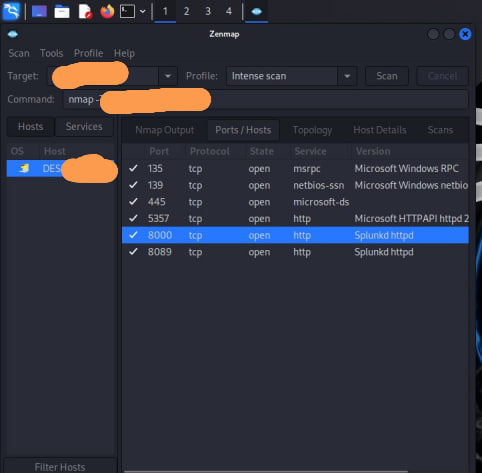

1. Reconnaissance
I used Zenmap to identify the attack surface. 

2. Exploitation
Executing a brute-force attack using Hydra on port 8000.

3. Detection & Analysis
Splunk captured the telemetry and visualized the spike in malicious activity.

Challenges Overcome:

Firewall Obstacles: Initially, the Windows host based firewall blocked all incoming traffic from the Kali VM but I successfully resolved this by elevating privileges and using PowerShell as an Administrator to modify the firewall profile.
